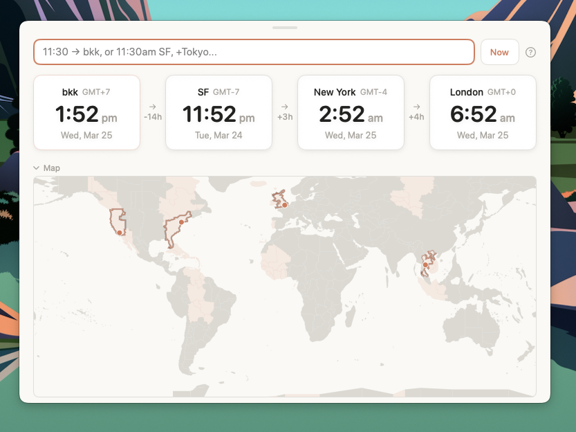

# TimeZoner

I work across Bangkok, San Francisco, New York, and London. Every day I need to coordinate meetings across these timezones. Going to Google and typing "what time is 3pm SF in Bangkok" is slow — the results page loads, I click through, sometimes the AI answer helps but it takes seconds to think. I just want to type and see the answer instantly.

TimeZoner is a tiny macOS app that floats over everything. Type a time, see it in all your zones. That's it.


*Docked to the menu bar*


*Floating, with the timezone map open*

## Install

Requires macOS 14+ (Sonoma).

The current no-Apple-account install path is source-built: TimeZoner is built and ad-hoc signed on your Mac. The Homebrew formula is HEAD-only until the next tagged release includes these packaging changes.

### Recommended: Homebrew source build

This builds TimeZoner locally from source and ad-hoc signs the app on your Mac.

```bash
brew tap nembal/timezoner https://github.com/nembal/Timezoner
brew install --HEAD timezoner
timezoner-install-app
timezoner
```

`timezoner` opens the Homebrew Cellar app bundle. After `timezoner-install-app`, you can launch the copied app from Spotlight/Finder or run:

```bash
open ~/Applications/TimeZoner.app
```

### Source checkout

```bash
git clone https://github.com/nembal/Timezoner.git
cd Timezoner
./install.sh --open
```

By default this installs to `~/Applications/TimeZoner.app`. Use `./install.sh --applications` for `/Applications`, or `./install.sh --destination /path/to/Applications` for another folder.

### Manual DMG install

The DMG is a manual fallback for people who prefer dragging the app into Applications:

**[Download the latest release DMG](https://github.com/nembal/Timezoner/releases/latest)**

Open the DMG, drag TimeZoner to Applications, then right-click and choose Open on first launch if macOS asks you to confirm trust. The app is ad-hoc signed but not Apple-notarized.

## How it works

**Just start typing.** The chat field is focused when the app opens. Type a time and a city, hit Enter.

### Set a time in any zone
```
3pm SF              → all cards update
11:30am bangkok     → all cards update
15:00 BKK           → 24-hour format works too
noon NYC            → special words work
```

### Compare across zones
```
1130am BKK in SF    → sets Bangkok time, highlights both cards
3pm london in tokyo → see what London afternoon is in Tokyo
```

### Quick bare time (applies to your active zone)
```
11:30               → updates whichever card was last edited
3pm                 → first card is your "home" zone by default
```

### Add and remove zones
```
+Tokyo              → adds a Tokyo card
add Hong Kong       → adds Hong Kong
-SF                 → removes SF
remove Europe       → removes Europe
```

### Timezone map

There's a world map below the cards. Your zones show up as highlighted bands with city dots. Hover any region to see the GMT offset, click to add it as a new card. The boundaries follow real timezone lines (not straight vertical stripes), so half-hour zones like India and Nepal show up correctly. Collapse it if you don't need it.

### Edit cards directly

Click any time on a card and start typing. All other cards update live as you type. Type `12` and it becomes 12:00. Type `3pm` and it becomes 15:00. Hit Enter or click away to finish.

### Drag to reorder

Hover a card and a small pill appears at the top. Grab it and drag left or right to rearrange your zones.

### Docks to the menu bar

The app starts right below your menu bar with a clean flat top. Drag it down to use it as a floating widget anywhere on screen. It remembers where you put it between launches.

### Stays on top

TimeZoner floats over all windows. Click the clock icon in your menu bar to show/hide it. Escape to dismiss. Global hotkey **⌘⌥T** toggles the panel from any app (rebindable in Settings).

### Settings

Click the ⚙ in the panel (or press **⌘,**) to open Settings:

- **Appearance** — System / Light / Dark override
- **Global hotkey** — click the recorder and press a new combo; Esc cancels, Clear unbinds
- **Launch at login** — opens automatically when you sign in
- **Input formats** — quick reference for the chat parser

### Works offline

376 built-in timezone aliases — cities, abbreviations (SF, NYC, HK, BKK), airport codes (SFO, JFK, LHR), country names. No network, no API keys, no accounts.

## Forgiving input

The parser handles messy typing. All of these work:

| Input | What it does |
|-------|-------------|
| `11:30am SF` | Standard format |
| `1130 am sf` | No colon, lowercase |
| `1130 a BKK` | Just "a" for AM |
| `3 p sf` | Just "p" for PM |
| `11:30 a.m. NYC` | Dotted AM/PM |
| `15:00 BKK` | 24-hour |
| `noon NYC` | Special words |
| `midnight CET` | Midnight |
| `1130am BKK in SF` | Cross-zone query |
| `+Tokyo` | Add zone |
| `-SF` | Remove zone |
| `12` | Bare time → active zone |

##  Raycast Extension

If you use [Raycast](https://www.raycast.com/), TimeZoner works there too. The extension is implemented in this repo and installs from source for now. Open **Convert Time** with `tz`, then type `3pm SF` to get conversions across your zones.

| Command | Keyword | What it does |
|---------|---------|-------------|
| Convert Time | `tz` | Type a time + city, see it in all your zones |
| World Clock | `wc` | Current time in all your zones |

Uses the same 376 timezone aliases as the macOS app.

`Convert Time` also supports `+Tokyo`, `add Hong Kong`, `-SF`, and `remove NYC`. Raycast stores its zone list in Raycast LocalStorage, so both Raycast commands share zones with each other. It does not sync that list with the macOS app. Press **⌘O** from Raycast to open TimeZoner.app through the `timezoner://` URL scheme when the app is installed.

### Install

```bash
git clone https://github.com/nembal/Timezoner.git
cd Timezoner/raycast
npm install
npm run dev
```

Open Raycast, type `tz` to open **Convert Time**, then enter `3pm SF`.

> You can also import it manually: Raycast → Settings → Extensions → `+` → Import Extension → select the [`raycast/`](https://github.com/nembal/Timezoner/tree/main/raycast) directory.

## Build from source

```bash
git clone https://github.com/nembal/Timezoner.git
cd Timezoner
./build.sh
open app/TimeZoner.app
```

Create a Manual DMG: `./scripts/create-dmg.sh 0.2.0`

Run checks:

```bash
scripts/test-install.sh
cd app && swift run TimeZonerTests
cd ../raycast && npm test && npm run lint && npm run build
```

Deep-link smoke test:

```bash
open "timezoner://open"
open "timezoner://set?hour=15&minute=30&zone=America%2FLos_Angeles&label=SF"
```

Release readiness is tracked in [docs/RELEASE_READINESS.md](docs/RELEASE_READINESS.md).

## Tech stack

- **SwiftUI + AppKit** — borderless floating NSPanel
- **Swift Package Manager** — no Xcode project needed
- **macOS 14+** — Observation framework (`@Observable`)
- **Zero dependencies** — no network, no external packages

## License

MIT — see [LICENSE](LICENSE).
