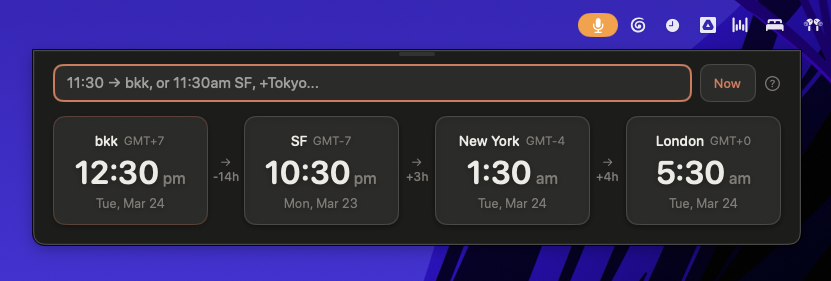
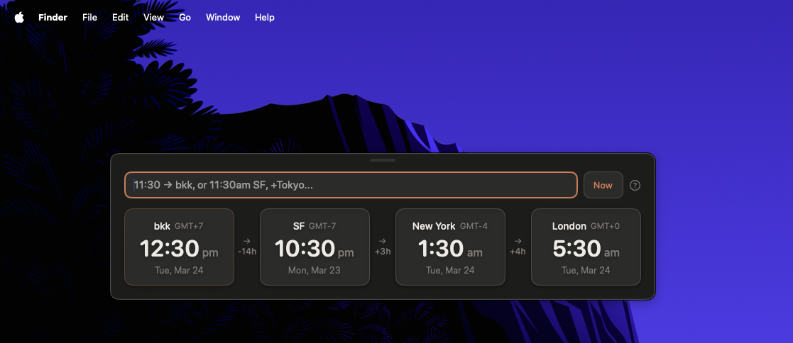

# TimeZoner

I work across Bangkok, San Francisco, New York, and London. Every day I need to coordinate meetings across these timezones. Going to Google and typing "what time is 3pm SF in Bangkok" is slow — the results page loads, I click through, sometimes the AI answer helps but it takes seconds to think. I just want to type and see the answer instantly.

TimeZoner is a tiny macOS app that floats over everything. Type a time, see it in all your zones. That's it.





## Download

**[Download the latest DMG](https://github.com/nembal/Timezoner/releases/latest)** (~440KB, Apple Silicon)

Open the DMG, drag to Applications, right-click → Open on first launch.
Requires macOS 14+ (Sonoma) on Apple Silicon (M1/M2/M3/M4/M5).

## How it works

**Just start typing.** The chat field is focused when the app opens. Type a time and a city, hit Enter.

### Set a time in any zone
```
3pm SF              → all cards update
11:30am bangkok     → all cards update
15:00 BKK           → 24-hour format works too
noon NYC            → special words work
```

### Compare across zones
```
1130am BKK in SF    → sets Bangkok time, highlights both cards
3pm london in tokyo → see what London afternoon is in Tokyo
```

### Quick bare time (applies to your active zone)
```
11:30               → updates whichever card was last edited
3pm                 → first card is your "home" zone by default
```

### Add and remove zones
```
+Tokyo              → adds a Tokyo card
add Hong Kong       → adds Hong Kong
-SF                 → removes SF
remove Europe       → removes Europe
```

### Edit cards directly

Click any time on a card and start typing. All other cards update live as you type. Type `12` and it becomes 12:00. Type `3pm` and it becomes 15:00. Hit Enter or click away to finish.

### Drag to reorder

Hover a card — a small pill appears at the top. Grab it and drag left or right to rearrange your zones. The time differences between cards update automatically.

### Docks to the menu bar

The app starts right below your menu bar with a clean flat top. Drag it down to use it as a floating widget anywhere on screen. It remembers where you put it between launches.

### Always on top, always fast

TimeZoner floats over all windows. Click the clock icon in your menu bar to show/hide it. Press Escape to dismiss. It's always one click away.

### Works offline

376 built-in timezone aliases — cities, abbreviations (SF, NYC, HK, BKK), airport codes (SFO, JFK, LHR), country names. No network, no API keys, no accounts.

## Forgiving input

The parser handles messy typing. All of these work:

| Input | What it does |
|-------|-------------|
| `11:30am SF` | Standard format |
| `1130 am sf` | No colon, lowercase |
| `1130 a BKK` | Just "a" for AM |
| `3 p sf` | Just "p" for PM |
| `11:30 a.m. NYC` | Dotted AM/PM |
| `15:00 BKK` | 24-hour |
| `noon NYC` | Special words |
| `midnight CET` | Midnight |
| `1130am BKK in SF` | Cross-zone query |
| `+Tokyo` | Add zone |
| `-SF` | Remove zone |
| `12` | Bare time → active zone |

##  Raycast Extension

If you use [Raycast](https://www.raycast.com/), TimeZoner works there too. Type `tz 3pm SF` and get conversions across your zones.

| Command | Keyword | What it does |
|---------|---------|-------------|
| Convert Time | `tz` | Type a time + city, see it in all your zones |
| World Clock | `wc` | Current time in all your zones |

Uses the same 376 timezone aliases as the macOS app.

### Install

```bash
git clone https://github.com/nembal/Timezoner.git
cd Timezoner/raycast
npm install
npm run dev
```

Open Raycast, type `tz 3pm SF`.

> You can also import it manually: Raycast → Settings → Extensions → `+` → Import Extension → select the [`raycast/`](https://github.com/nembal/Timezoner/tree/main/raycast) directory.

## Build from source

```bash
git clone https://github.com/nembal/Timezoner.git
cd Timezoner
./build.sh
open app/TimeZoner.app
```

Create a DMG: `./scripts/create-dmg.sh 0.1.0`

Run tests: `cd app && swift run TimeZonerTests`

## Tech stack

- **SwiftUI + AppKit** — borderless floating NSPanel
- **Swift Package Manager** — no Xcode project needed
- **macOS 14+** — Observation framework (`@Observable`)
- **Zero dependencies** — no network, no external packages

## License

MIT — see [LICENSE](LICENSE).
